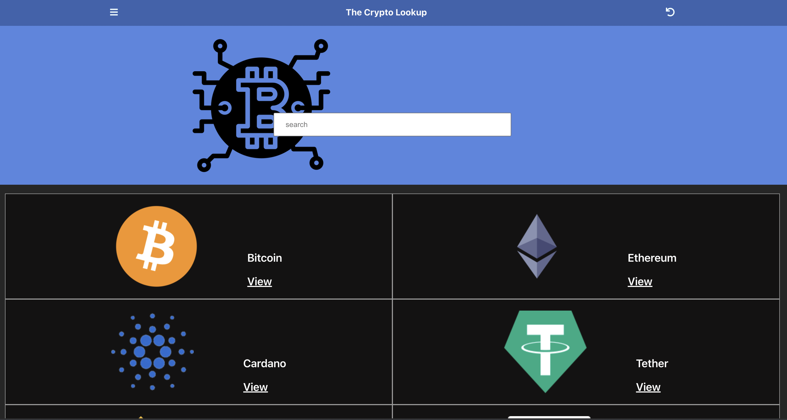

#  Crypto Catalogue App Built with React and Redux
A catalogue of cryptocurrencies and their current price information which is fetched from the API coingecko.

Users can filter the displayed cryptocurrencies by searching their names. Then directly view each individually.

## BUILT WITH
- JavaScript
- NPM
- Node.js
- CSS
- ES6
- React
- React-Create-App
- Redux
- CSS

## Live Demo
# [view site](https://crypto-lookup-capstone.herokuapp.com)

## Getting Started
# Prerequisities

To run this project locally, you must have node and npm installed on your machine.

# Setup
To set up this project on your local machine:

Navigate to the folder where you want the repository to be copied and run 

`git clone https://github.com/Stephanie041996/Crypto-Catalogue.git`

Navigate to the directory :

`cd crypto-tracker`

To start the server: 

`npm start`

Go to http://localhost:3000/ in your browser to see the application running

# To test the code

 - Run npm test
 - Enter 'a' to see all tests
## Author
**Stephanie Sakuhuni**

- GitHub: [@stephanie041996](https://github.com/Stephanie041996)
- LinkedIn: [Stephanie Sakuhuni](www.linkedin.com/in/stephanie-michelle-sakuhuni) 

​
- 
## 🤝 Contributing

Contributions, issues, and feature requests are welcome!

Feel free to check the [issues page](../../issues/).

## Show your support

Give a ⭐️ if you like this project!

## Acknowledgments

- Hat tip to anyone whose code was used
- Inspiration
- etc

## 📝 License

This project is [MIT](./MIT.md) licensed.
